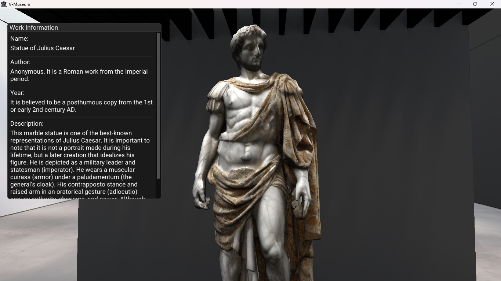
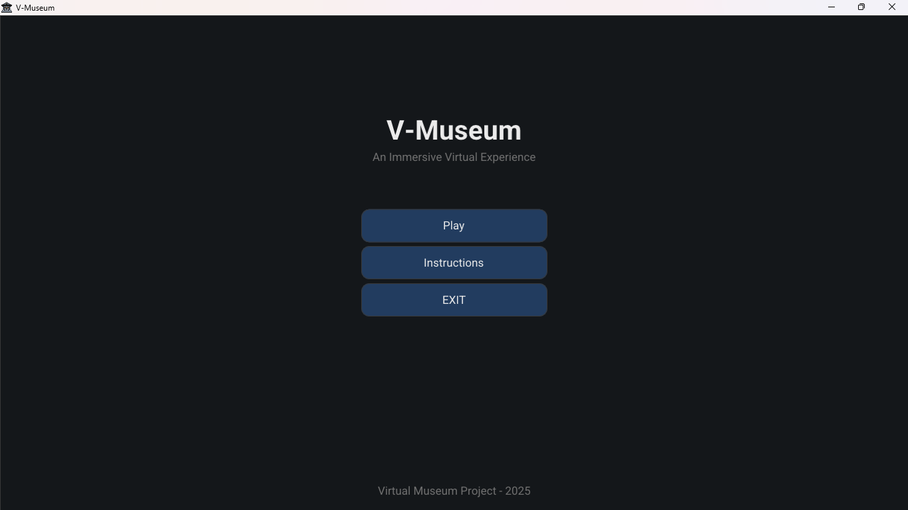
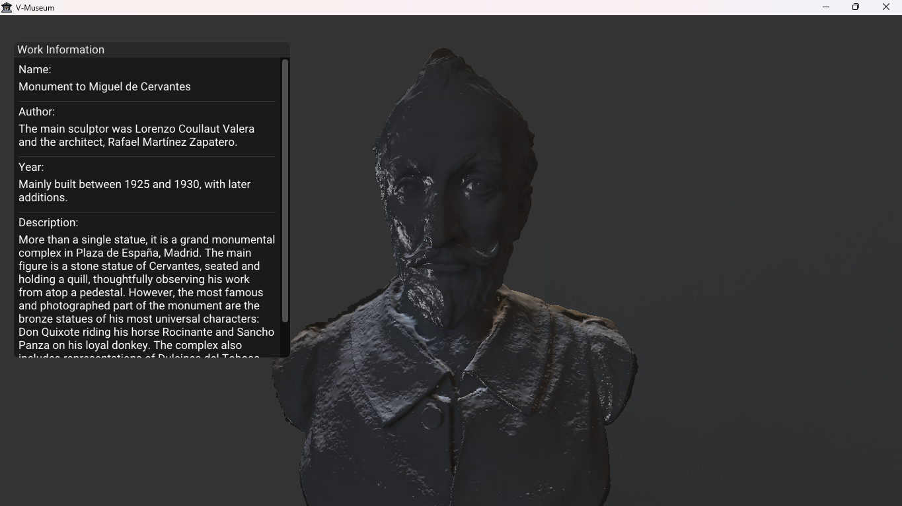
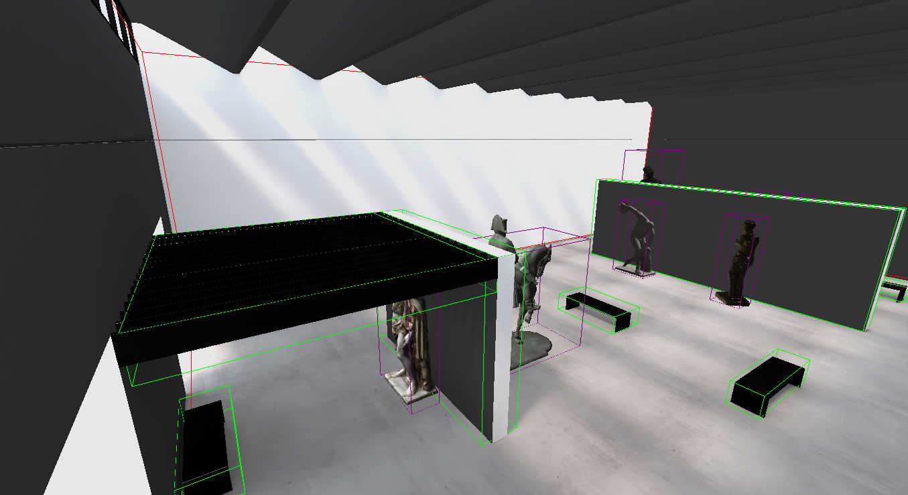
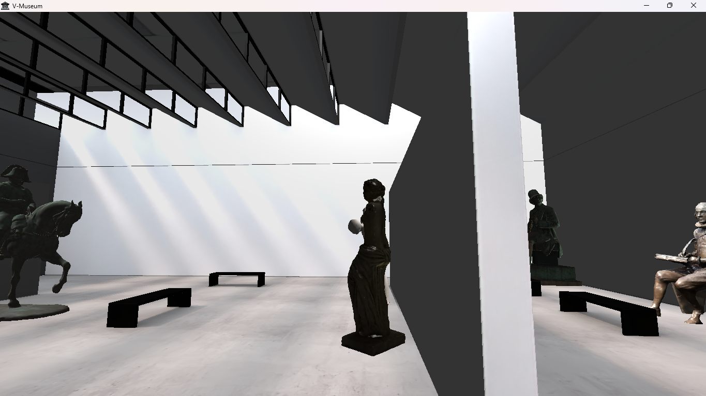

# V-Museum

[](https://github.com/Rpla2/-V-Museum/graphs/contributors)
[](LICENSE)
[]()
[]()
[](https://github.com/ocornut/imgui)
[](https://www.glfw.org/)
[](https://glad.dav1d.de/)
[](https://glm.g-truc.net/)
[](https://www.ambiera.com/irrklang/)

## Abstract

V-Museum is an interactive 3D virtual museum simulation that allows users to explore renowned historical sculptures and monuments. Built with C++ and OpenGL, the application features real-time rendering, intuitive camera controls, and an ImGui-powered interface for seamless interaction.

<p align="center">
  
</p>

## Features

- **Interactive 3D Museum:** Explore a virtual gallery with a collection of historical sculptures.
- **Real-Time Rendering:** High-quality rendering of 3D models using modern OpenGL.
- **Dynamic Camera:** First-person camera controls for intuitive navigation.
- **In-Game GUI:** An interactive menu and information panels powered by ImGui.
- **Ambient Audio:** Background music to enhance the museum experience.
- **Model Interaction:** View detailed information about each sculpture.

## Technologies Used

- 💻 C++17
- 🎨 OpenGL 3.3
- 🖼️ GLFW (window & input)
- 📦 GLAD (OpenGL loader)
- 📐 GLM (math)
- 🖱️ ImGui (GUI)
- 🎵 irrKlang (audio)
- 🖼️ stb_image (texture loading)
- 📄 nlohmann/json (gltf parsing)

## Getting Started

### Prerequisites

- Windows 10 or later
- Visual Studio Community 2019/2022 with C++ workload
- Git
- The project uses relative paths for dependencies (folder `deps`); no manual configuration of include/library paths is required

### Build & Run

1. Clone the repository:
   ```powershell
   
   git clone https://github.com/Rpla2/-V-Museum.git
   ```
2. Open `-V-Museum.sln` in Visual Studio.
3. Set the solution configuration to **Debug** or **Release**.
4. Build the solution (Ctrl+Shift+B).
5. Run the executable from `x64\Debug\-V-Museum.exe` or `x64\Release\-V-Museum.exe`.

## Installing the Standalone Executable

> **Note:** Standalone installer coming soon.

## Screenshots

<table>
  <tr>
    <td width="50%" align="center">
      
    </td>
    <td width="50%" align="center">
      
    </td>
  </tr>
  <tr>
    <td width="50%" align="center">
    
    </td>
    <td width="50%" align="center">
    
    </td>
  </tr>
</table>

## YouTube Demo Video

📺 Watch a live demo on YouTube: [https://youtu.be/Ki4vbg6V8IA](https://youtu.be/Ki4vbg6V8IA)

## License

This project is licensed under the MIT License. See the [LICENSE](LICENSE) file for details.

## Acknowledgements

- The 3D models used in this project are sourced from Sketchfab and other public domain platforms. All rights belong to their respective creators.
- Music provided by various artists under free-to-use licenses.

## Authors

- <a href="https://github.com/Rpla2"></a> **Rpla2** ([@Rpla2](https://github.com/Rpla2))
- <a href="https://github.com/yels0"></a> **yels0** ([@yels0](https://github.com/yels0))
- <a href="https://github.com/FURIAZUL"></a> **FURIAZUL** ([@FURIAZUL](https://github.com/FURIAZUL))
